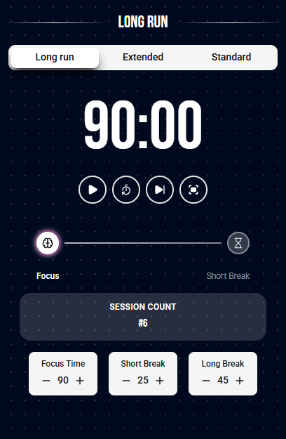
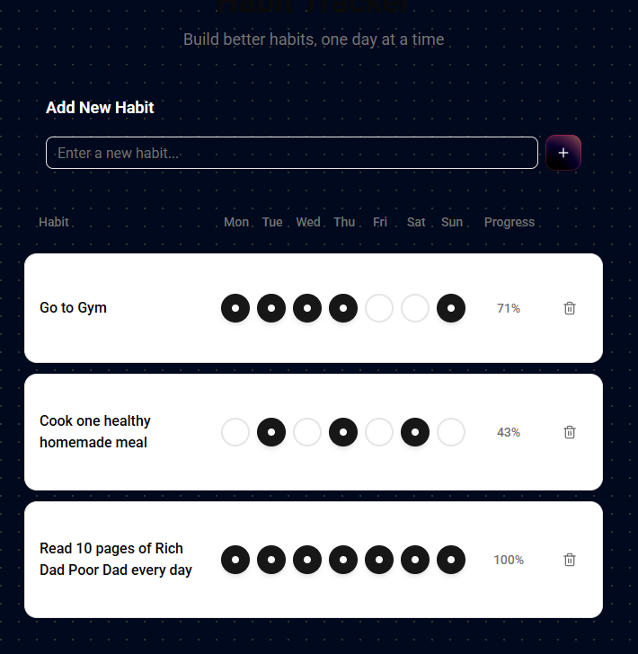
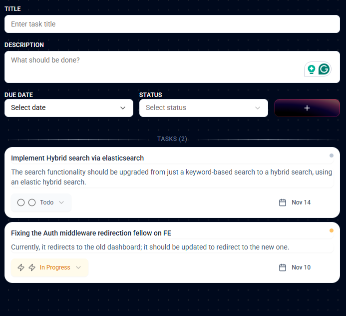
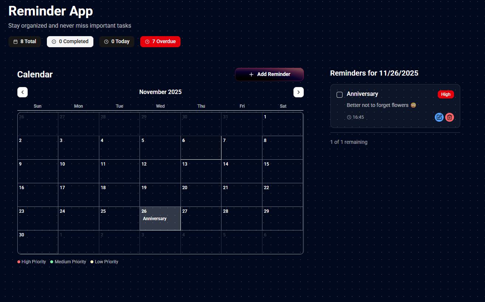

# Zendoro

🧘‍♂️⏱️Nowadays, being focused and having high productivity is a difficult thing, considering social media and media in general. Most people struggle to put their focus into a task and get it done or break it down into smaller chunks and tackle the challenges one at a time. This situation included me as well. I first tried by deleting my social media, and up until today, I still don’t have some of them. But the cheap dopamine addiction of scrolling can be found today in all sorts of apps, and you cannot simply prevent it, one way or another it comes back at you.

The ProblemI started to search online to see if someone had tackled this situation before and managed to achieve higher productivity. After some research, I came across a method called Pomodoro, which is a time management technique that focuses on having short intervals of focused work followed by short rests. At first, it sounded a bit weird to me, but I tried it using some online tools, and the results were shocking. I could turn off my burnout or at least suppress the noise and focus on one thing at a time, avoiding the infinite loop of trying to solve everything and ending up burned out. The short breaks in between helped me pause and then tackle the problem again.

Nowadays, being focused and having high productivity is a difficult thing, considering social media and media in general. Most people struggle to put their focus into a task and get it done or break it down into smaller chunks and tackle the challenges one at a time. This situation included me as well. I have been using this technique ever since. I was using some online tools to keep track of my sessions, but I felt they did not look the best. Then the question came to mind: why do I not create a better version of this?

I first tried by deleting my social media, and up until today, I still don't have some of them. But the cheap dopamine addiction of scrolling can be found today in all sorts of apps, and you cannot simply prevent it, one way or another, it comes back at you.And that was the starting point of Zendoro, which is an abbreviation of Zen state plus Pomodoro.

## The Discovery

A Zen state is a state of relaxed, mindful awareness where one accepts things as they are without judgment.

I started to search online to see if someone had tackled this situation before and managed to achieve higher productivity. After some research, I came across a method called **Pomodoro**, which is a time management technique that focuses on having short intervals of focused work followed by short rests. As I was progressing with the app, the idea came to my mind: why not make this a fully functional productivity app, a central location for all the digital tools I use on different platforms, all in one place?

At first, it sounded a bit weird to me, but I tried it using some online tools, and the results were shocking. I could turn off my burnout or at least suppress the noise and focus on one thing at a time, avoiding the infinite loop of trying to solve everything and ending up burned out. The short breaks in between helped me pause and then tackle the problem again.Then, the functionality of the app was extended to include a Habit Tracker that shows your daily habits in comparison to your commitment to them (I really like this method, and I learned it from the book Atomic Habits),

I have been using this technique ever since. I was using some online tools to keep track of my sessions, but I felt they did not look the best. Then the question came to mind: **why do I not create a better version of this?**as well as a Calendar for keeping the most important dates in one place and a To-Do List to keep tasks and their priorities organized.

## What is Zendoro?

And of course, what makes this app stand out is the fact that it has an assistant that is always there, so you can communicate in human-like language to keep your time organized and plan ahead.

**Zendoro** is an abbreviation of **Zen state** + **Pomodoro**.When you have a busy calendar full of meetings,

you could simply ask for the earliest possible date available for an appointment,

> A Zen state is a state of relaxed, mindful awareness where one accepts things as they are without judgment.or you could ask, What are the highest priority tasks in my to-do list within the first days of next month?,

or any sort of question you want to ask about your information, including How well am I keeping my promises to my habits?

## Screenshots

## Evolution of the App

You could also ask for a summary of your day, such as What meetings do I have today and what tasks should I focus on first?,

As I was progressing with the app, the idea came to my mind: why not make this a fully functional productivity app, a central location for all the digital tools I use on different platforms, all in one place?or request suggestions on how to rearrange your schedule if something urgent comes up.

If you want to plan ahead for the week or month, you could ask, Which days are best to allocate for deep work sessions or project deadlines?

The functionality of the app was extended to include:The assistant can even provide insights on your productivity patterns, for example, When am I usually most focused or distracted?

It can remind you of recurring commitments, track your progress on long-term goals, and help you prioritize tasks based on urgency and importance.

- **Habit Tracker** - Shows your daily habits in comparison to your commitment to them (I really like this method, and I learned it from the book _Atomic Habits_)Essentially, it acts like a personal productivity manager, allowing you to interact naturally while keeping everything organized and ensuring nothing slips through the cracks.

- **Calendar** - For keeping the most important dates in one place

- **To-Do List** - To keep tasks and their priorities organizedThis functionality uses the Gemini API Function Calling feature (https://ai.google.dev/gemini-api/docs/function-calling?example=meeting

), which allows Gemini to interact with your API and endpoints to get the relevant data within the scope you define.

## AI Assistant Integration

This app, at its core, is built to collect all my productivity tools in one place and serves as a proof of concept for something bigger.

And of course, what makes this app stand out is the fact that it has an **AI assistant** that is always there, so you can communicate in human-like language to keep your time organized and plan ahead.It is built on a three-tier architecture and MVC pattern, using TypeScript, React, Node (Express), and Docker for production deployment, along with PostgreSQL as the database.

### What You Can Ask:

For example, in the future, if I continue developing this app, I would make it possible to have multiple integrations from different calendars, a reminder service, and even an email system that sends notifications one day before a task deadline, as well as real-time voice assistance that can communicate not just via text but also by voice.

When you have a busy calendar full of meetings, you could:However, all these features require resources and time, and I have neither at the moment, since I am working and studying full-time. But still, at this point, I am happy that I could bring this app to life and create a starting point for a bigger vision.

- Ask for the earliest possible date available for an appointmentI believe this app is a strong candidate for the AI and Smarter Work of the Staff Base AI Challenge, and I truly hope it wins. 🙋🏼‍♂️

- Ask, _"What are the highest priority tasks in my to-do list within the first days of next month?"_
- Ask any sort of question about your information, including _"How well am I keeping my promises to my habits?"_

You could also:

- Request a summary of your day: _"What meetings do I have today and what tasks should I focus on first?"_
- Request suggestions on how to rearrange your schedule if something urgent comes up
- Plan ahead: _"Which days are best to allocate for deep work sessions or project deadlines?"_
- Get insights on productivity patterns: _"When am I usually most focused or distracted?"_

The assistant can:

- Remind you of recurring commitments
- Track your progress on long-term goals
- Help you prioritize tasks based on urgency and importance
- Act like a personal productivity manager, allowing you to interact naturally while keeping everything organized and ensuring nothing slips through the cracks

### Technical Implementation

This functionality uses the [Gemini API Function Calling feature](https://ai.google.dev/gemini-api/docs/function-calling?example=meeting), which allows Gemini to interact with your API and endpoints to get the relevant data within the scope you define.

## Technical Stack

This app, at its core, is built to collect all my productivity tools in one place and serves as a proof of concept for something bigger.

**Architecture & Technologies:**

- Three-tier architecture and MVC pattern
- **Frontend:** TypeScript, React
- **Backend:** Node.js (Express)
- **Database:** PostgreSQL
- **Deployment:** Docker for production

## Future Vision

In the future, if I continue developing this app, I would make it possible to have:

- Multiple integrations from different calendars
- A reminder service
- An email system that sends notifications one day before a task deadline
- Real-time voice assistance that can communicate not just via text but also by voice

However, all these features require resources and time, and I have neither at the moment, since I am working and studying full-time. But still, at this point, I am happy that I could bring this app to life and create a starting point for a bigger vision.

---

I believe this app is a strong candidate for the **AI and Smarter Work of the Staff Base AI Challenge**, and I truly hope it wins. 🙋🏼‍♂️

### Contributors

- **Developer:** [Amir Khamseh](https://amir-khamseh.com/)
- **DevOps:** [Oleksandr Boretskyi](http://www.linkedin.com/in/oleksandr-boretskyi-4155a422b)
