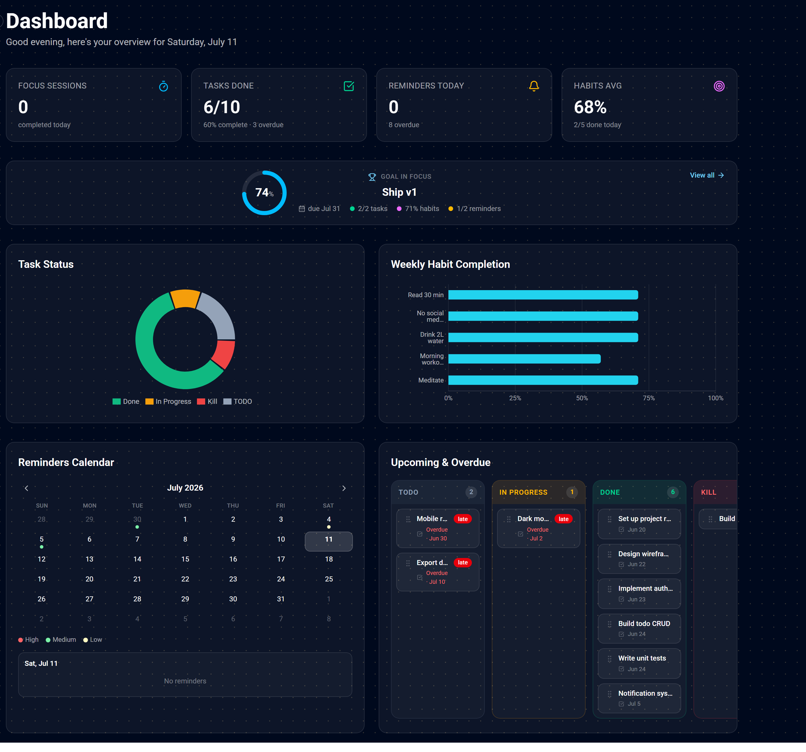
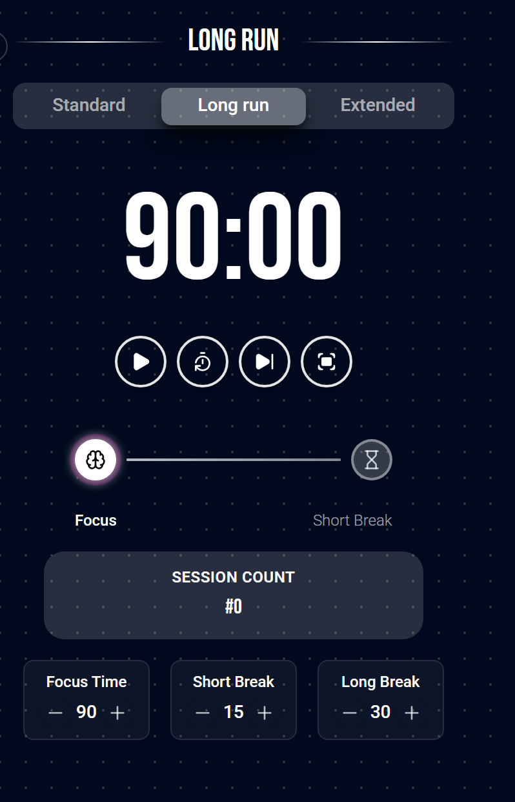
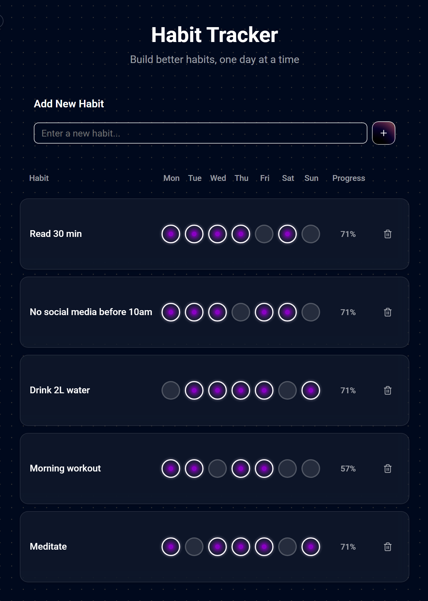
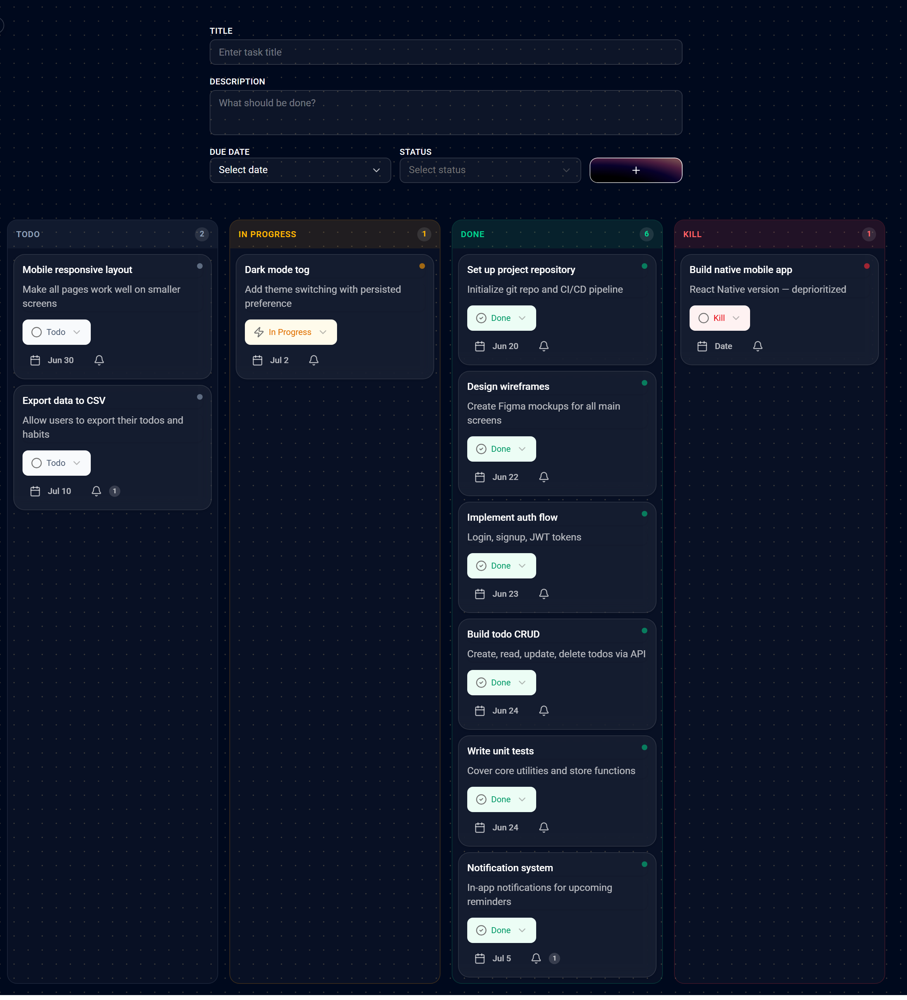
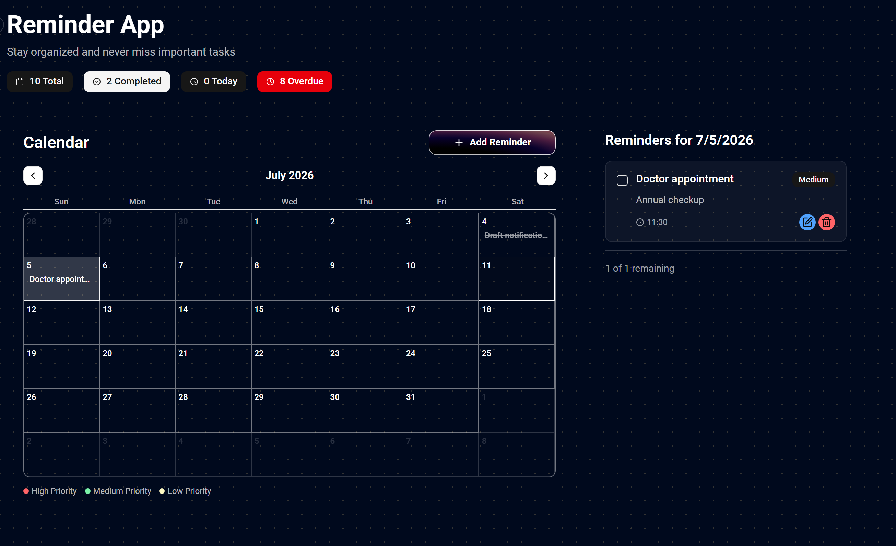
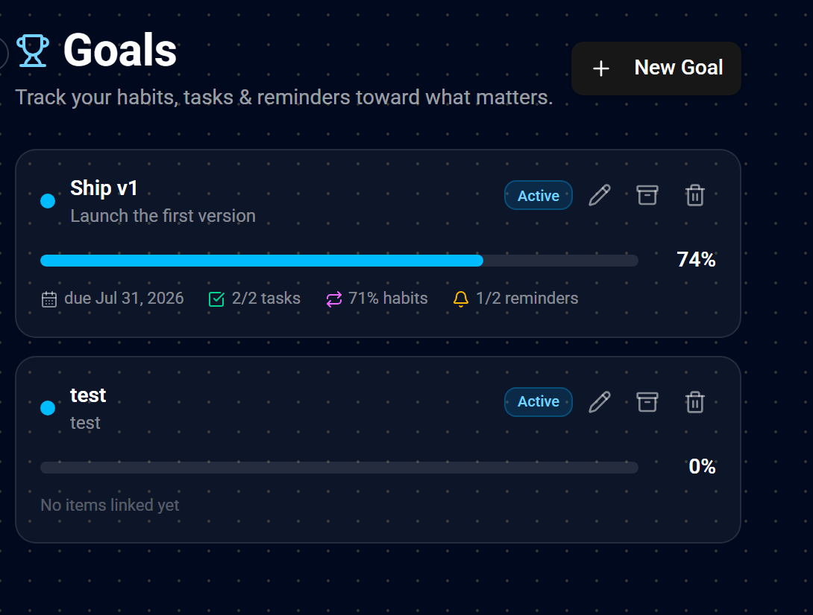
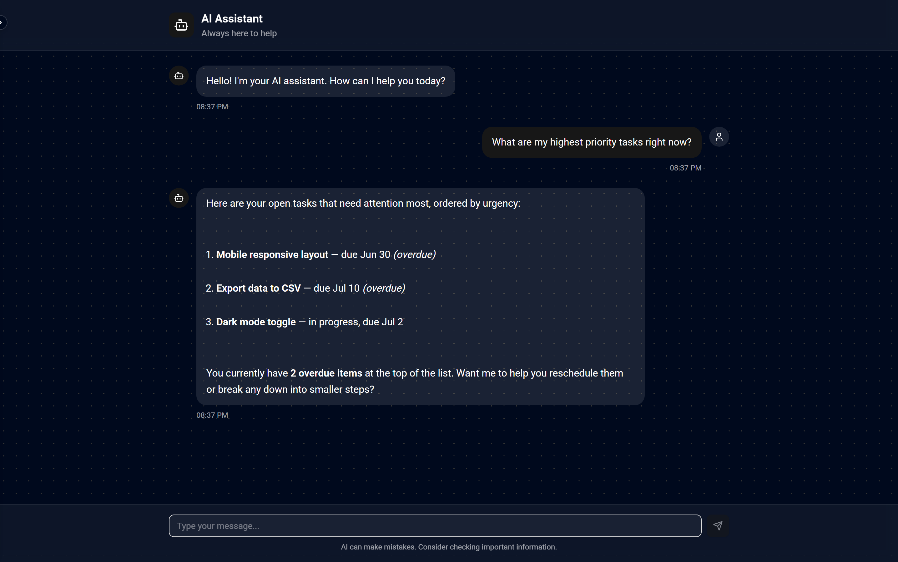
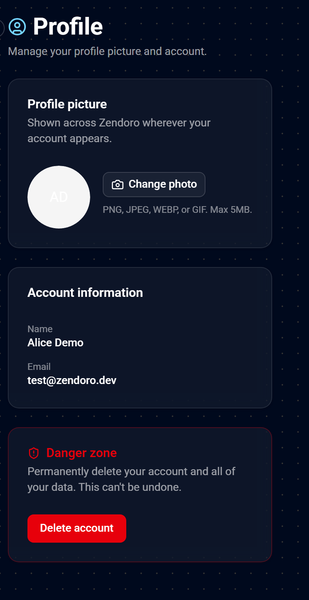
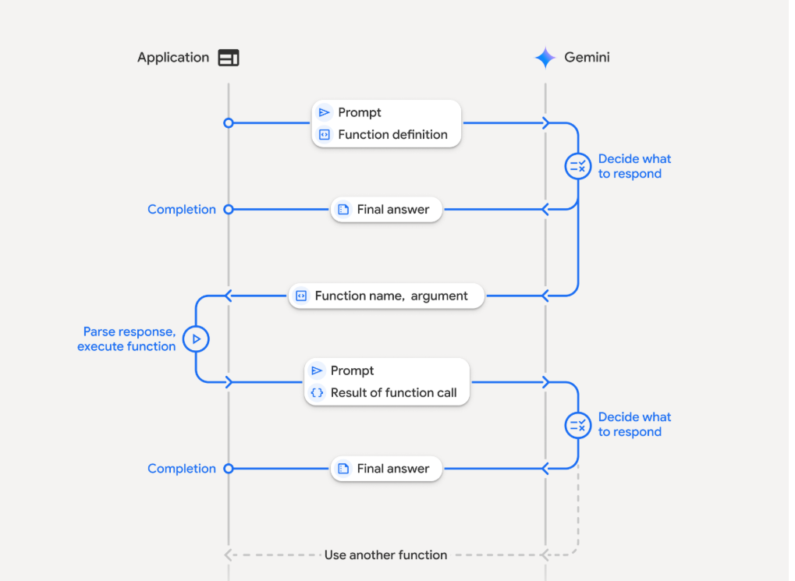

# Zendoro

🧘‍♂️⏱️ Staying focused is hard, especially with social media and endless notifications pulling at your attention. Zendoro is a productivity app built around the Pomodoro technique, combined with a habit tracker, a calendar and reminder system, a goal tracker, and an AI assistant that can answer questions about your own data.

Zendoro is short for Zen state plus Pomodoro. The name comes from the idea of staying calm and mindful while working through short, focused bursts of effort with breaks in between, instead of trying to power through everything at once and burning out.

It is built as a three tier application using TypeScript, React, Node (Express), and PostgreSQL, and it ships with Docker for production deployment.

Backend repo: https://github.com/Amirali-Khamseh/zendoro-backend
Production: https://zendoro-delta.vercel.app/

## Pages and Features

Every authenticated page lives behind the sidebar shown on the left of the app. Below is a walkthrough of each page and what it does.

### Sign Up

Creates a new account with a name, email, and password. Passwords must be at least 8 characters and include an uppercase letter, a lowercase letter, a number, and a special character. After signing up, the account is not active yet: a 6 digit verification code is emailed to the address you provided, and you are redirected to the verify email page to enter it.

### Verify Email

Enter the 6 digit code sent to your inbox to activate your account. If the code expired or never arrived, you can request a new one from the same page. Once verified, you are logged in automatically and taken to the dashboard.

### Login

Sign in with your email and password. From here you can also jump to the sign up page if you do not have an account yet, or to the forgot password page if you cannot remember your password.

### Forgot Password

Enter your email to receive a 6 digit reset code. Submitting the form takes you straight to the reset password page with your email pre filled.

### Reset Password

Enter the 6 digit code from your email along with a new password to regain access to your account. There is also a resend button in case the original code expired.

### Dashboard

The dashboard is the first page you see after logging in. It pulls together a summary of everything happening across the app: focus sessions completed today, tasks done versus total with an overdue count, how many reminders are due today, and your average habit completion rate. Below that sits a card for whichever goal you have marked as the one to focus on, showing its progress and how many linked tasks, habits, and reminders are done. Further down are a task status chart, a weekly habit completion chart, a mini reminders calendar, and an upcoming and overdue task list.

  

### Focus Time

A Pomodoro style timer with three built in modes: Standard, Extended, and Long run, each with its own focus, short break, and long break durations. You can start, pause, skip, and go fullscreen, switch between focus and short break manually, and fine tune the minutes for each phase. A session counter tracks how many focus sessions you have completed.

  

### Habit Tracker

Add habits you want to build and track them across a Monday to Sunday grid. Each day is a toggle: tap it to mark the habit done for that day. A progress percentage is calculated per habit based on how many days you have completed it, and each habit can be deleted from the list.

  

### TODOs

A drag and drop Kanban board with four columns: TODO, In Progress, Done, and Kill. Add a task with a title, an optional description, a due date, and a starting status, then drag cards between columns as work progresses. Each column shows a live count of how many tasks are in it.

  

### Reminder

A calendar based reminder system. The header shows total, completed, today, and overdue counts at a glance. Pick a date on the calendar to see and manage the reminders for that day, and add new reminders with a title, description, date, time, and priority level (low, medium, or high). Reminders can also be linked to a specific task, so completing every linked reminder automatically marks the task as done.

  

### Goals

Goals let you tie together tasks, habits, and reminders under one target. Create a goal with a title, description, and target date, then link existing tasks, habits, and reminders to it. Zendoro calculates an overall progress percentage automatically from the linked items, and you can mark a goal as active, completed, or archived.

  

### AI Assistant

A chat interface backed by Gemini function calling. Ask it things like whether you have any reminders before the end of the month, what your highest priority tasks are, or how consistent you have been with a habit, and it queries your real data through the API to answer. Responses render as formatted Markdown, including lists, code blocks, and links.

  

### Profile

Shows your account information (name and email) and lets you upload or remove a profile picture. There is also a danger zone to permanently delete your account and all of its data, which requires re entering your password to confirm.

  

## How the AI Assistant Works

The assistant is built on Gemini's function calling feature. Instead of just generating text, the model can decide to call a defined function such as "get my tasks due this week" or "get my habit completion for this month," receive the real result from the API, and then use that result to write its final answer. This is what lets it answer questions grounded in your actual data instead of guessing.

  

You can ask things like:

- What are the highest priority tasks in my to do list within the first days of next month?
- Do I have any reminders before the end of this month?
- How well am I keeping my promises to my habits?
- What meetings or tasks do I have today?
- When am I usually most focused or distracted?

## Technical Stack

- Three tier architecture and MVC pattern
- Frontend: TypeScript, React, TanStack Router, Zustand, Tailwind CSS
- Backend: Node.js (Express), Drizzle ORM
- Database: PostgreSQL
- Deployment: Docker for production

## Running Locally

The `test-backend` folder contains a self contained mock backend (Express and Postgres, run with `docker compose up`) for local development, so you do not need the real backend or a production database to try out the app. It seeds a demo account on startup so every page in this README can be exercised locally.

## Future Vision

Ideas for where the app could go next:

- Multiple integrations with different calendar providers
- A dedicated reminder service
- Email notifications sent ahead of task deadlines
- Real time voice assistance, not just text

These take time and resources that are limited right now, since this is built alongside working and studying full time. Still, it is a solid starting point for a bigger vision.

---

- Developer: [Amir Khamseh](https://amir-khamseh.com/)
